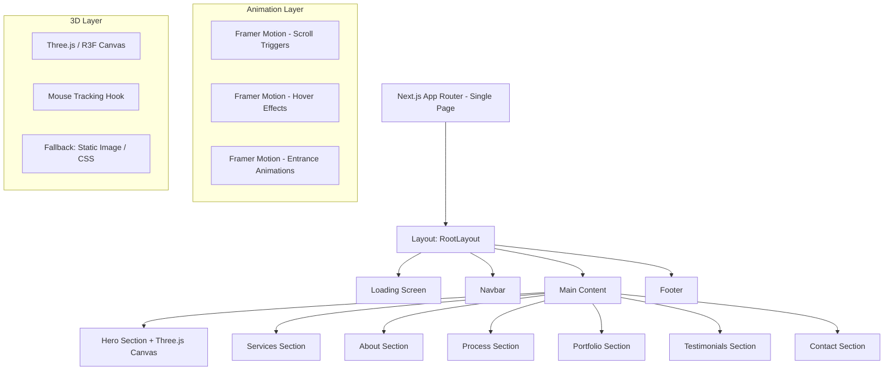

# Design Document: Diska Digital Website

## Overview

This design describes a premium, single-page marketing website for Diska Digital, a technology company based in Mali. The site is built with Next.js 14+ (App Router), Tailwind CSS, shadcn/ui, Framer Motion, and Three.js. It features a dark theme with glassmorphism effects, scroll-triggered animations, interactive 3D elements, a contact form with validation, and a fully responsive layout.

The website is a single-page application with section-based navigation. All content lives on one route (`/`), with smooth-scroll anchor links navigating between sections. A branded loading screen displays on initial load, and 3D elements provide an immersive, premium feel.

## Architecture

### High-Level Architecture



### Technology Stack

| Layer | Technology | Purpose |
|-------|-----------|---------|
| Framework | Next.js 14+ (App Router) | SSR, routing, code splitting |
| Styling | Tailwind CSS + shadcn/ui | Utility-first CSS, component library |
| Animation | Framer Motion | Scroll animations, transitions, micro-interactions |
| 3D Rendering | Three.js via @react-three/fiber + @react-three/drei | Interactive 3D scenes |
| Language | TypeScript | Type safety |
| Images | Next.js Image component | Optimized image delivery |

### Project Structure

```
src/
├── app/
│   ├── layout.tsx          # Root layout (fonts, metadata, providers)
│   ├── page.tsx            # Home page composing all sections
│   └── globals.css         # Tailwind directives, custom CSS variables
├── components/
│   ├── layout/
│   │   ├── Navbar.tsx
│   │   └── Footer.tsx
│   ├── sections/
│   │   ├── HeroSection.tsx
│   │   ├── ServicesSection.tsx
│   │   ├── AboutSection.tsx
│   │   ├── ProcessSection.tsx
│   │   ├── PortfolioSection.tsx
│   │   ├── TestimonialsSection.tsx
│   │   └── ContactSection.tsx
│   ├── three/
│   │   ├── HeroCanvas.tsx       # R3F Canvas wrapper (dynamic import)
│   │   ├── FloatingShapes.tsx   # 3D scene with abstract shapes
│   │   └── MouseTracker.tsx     # Mouse position → 3D rotation
│   ├── ui/
│   │   ├── LoadingScreen.tsx
│   │   ├── SectionWrapper.tsx   # Reusable scroll-animation wrapper
│   │   ├── GlassCard.tsx        # Glassmorphism card component
│   │   └── AnimatedButton.tsx
│   └── forms/
│       └── ContactForm.tsx
├── hooks/
│   ├── useMousePosition.ts
│   ├── useScrollSection.ts
│   └── useReducedMotion.ts
├── lib/
│   ├── constants.ts         # Section IDs, nav links, service data
│   ├── validators.ts        # Contact form validation logic
│   └── utils.ts             # cn() helper, misc utilities
└── types/
    └── index.ts             # Shared TypeScript interfaces
```

## Components and Interfaces

### 1. RootLayout (`app/layout.tsx`)

Provides global font loading (Inter or similar sans-serif via `next/font`), metadata, and wraps children with any context providers needed (e.g., reduced-motion detection).

### 2. HomePage (`app/page.tsx`)

Composes all sections in order. Manages the loading screen state (visible until critical assets load or 3s timeout).

```typescript
// Pseudocode
export default function HomePage() {
  return (
    <>
      <LoadingScreen />
      <Navbar />
      <main>
        <HeroSection />
        <ServicesSection />
        <AboutSection />
        <ProcessSection />
        <PortfolioSection />
        <TestimonialsSection />
        <ContactSection />
      </main>
      <Footer />
    </>
  );
}
```

### 3. Navbar (`components/layout/Navbar.tsx`)

- Fixed position, z-50
- Logo on left, nav links on right
- Glassmorphism background activates after scrolling past hero (tracked via `useScrollSection`)
- Mobile: hamburger icon toggles full-screen overlay menu
- Links trigger `scrollIntoView({ behavior: 'smooth' })` on target section IDs

```typescript
interface NavLink {
  label: string;
  href: string; // e.g., "#services"
}
```

### 4. LoadingScreen (`components/ui/LoadingScreen.tsx`)

- Displays Diska Digital logo with animated entrance (scale + fade)
- Uses `useEffect` to track document ready state
- Auto-dismisses after 3 seconds max via `setTimeout`
- Fades out with Framer Motion `AnimatePresence`

### 5. HeroSection (`components/sections/HeroSection.tsx`)

- Full viewport height (h-screen)
- Heading: "We modernize your business" — large bold text
- Subtext: "Web. IT. Design. Print."
- CTA button: "Get Started" → scrolls to `#contact`
- Background: `HeroCanvas` (dynamically imported Three.js scene)
- Entrance animation: fade-in + slide-up on heading, subtext, CTA (staggered)

### 6. HeroCanvas (`components/three/HeroCanvas.tsx`)

- Dynamically imported with `next/dynamic` (ssr: false) to avoid SSR issues and reduce initial bundle
- Uses `@react-three/fiber` Canvas and `@react-three/drei` helpers
- Renders `FloatingShapes` scene
- `MouseTracker` component reads mouse position from `useMousePosition` hook and applies subtle rotation to the scene group
- Fallback: on mobile (<768px) or when WebGL is unavailable, renders a static gradient or CSS animation instead

### 7. SectionWrapper (`components/ui/SectionWrapper.tsx`)

Reusable wrapper that applies Framer Motion scroll-triggered fade-in animation to any section content.

```typescript
interface SectionWrapperProps {
  id: string;
  children: React.ReactNode;
  className?: string;
  stagger?: boolean; // Enable staggered children animation
}
```

- Uses `useInView` from Framer Motion
- Respects `prefers-reduced-motion` via `useReducedMotion` hook (disables animations when set)
- Animation: fade from opacity 0 → 1, translateY from 40px → 0, duration 600ms, ease-out

### 8. GlassCard (`components/ui/GlassCard.tsx`)

Reusable card with glassmorphism styling:
- `bg-white/5 backdrop-blur-lg border border-white/10 rounded-2xl`
- Hover animation: scale(1.02) + subtle glow via box-shadow

### 9. ServicesSection (`components/sections/ServicesSection.tsx`)

- Grid layout: 4 cols desktop, 2 cols tablet, 1 col mobile
- Each block: icon (Lucide icon), title, description
- Hover: scale + glow via GlassCard
- Staggered fade-in on scroll

### 10. AboutSection (`components/sections/AboutSection.tsx`)

- Two-column layout: text left, visual right (image or illustration)
- Heading + mission description paragraph
- Fade-in on scroll

### 11. ProcessSection (`components/sections/ProcessSection.tsx`)

- Four steps displayed with timeline/connector visual
- Each step: number badge, title, description
- Staggered entrance animation on scroll
- Desktop: horizontal timeline; Mobile: vertical timeline

### 12. PortfolioSection (`components/sections/PortfolioSection.tsx`)

- Grid: 2 cols desktop, 1 col mobile
- Project cards: thumbnail, title, category tag
- Hover: scale + overlay reveal
- Staggered fade-in on scroll

### 13. TestimonialsSection (`components/sections/TestimonialsSection.tsx`)

- 3 testimonial cards in a row (desktop), stacked on mobile
- Each card: avatar, client name, company, quote text
- GlassCard styling
- Fade-in on scroll

### 14. ContactSection (`components/sections/ContactSection.tsx`)

- Two-column layout: contact info left, form right
- Contact info: WhatsApp link, phone, email (with icons)
- Embeds `ContactForm` component

### 15. ContactForm (`components/forms/ContactForm.tsx`)

- Fields: fullName, email, subject, message
- Client-side validation using `validators.ts`
- Inline error messages per field
- Success state: shows confirmation message after submission
- Uses React state for form management (no external form library needed for this scope)

```typescript
interface ContactFormData {
  fullName: string;
  email: string;
  subject: string;
  message: string;
}

interface ValidationErrors {
  fullName?: string;
  email?: string;
  subject?: string;
  message?: string;
}
```

### 16. Footer (`components/layout/Footer.tsx`)

- Company name/logo
- Navigation links (same as Navbar)
- Social media icons (Facebook, Instagram, LinkedIn, X)
- Copyright notice with dynamic year

### Hooks

| Hook | Purpose |
|------|---------|
| `useMousePosition` | Tracks normalized mouse coordinates for 3D parallax |
| `useScrollSection` | Detects if user has scrolled past hero for navbar glassmorphism |
| `useReducedMotion` | Reads `prefers-reduced-motion` media query |

## Data Models

Since this is a static marketing website with no backend, data is defined as TypeScript constants/types.

```typescript
// types/index.ts

interface Service {
  icon: string;       // Lucide icon name
  title: string;
  description: string;
}

interface ProcessStep {
  number: number;
  title: string;
  description: string;
}

interface Project {
  title: string;
  category: string;
  thumbnail: string;  // Image path
}

interface Testimonial {
  name: string;
  company: string;
  text: string;
  avatar: string;     // Image path
}

interface NavLink {
  label: string;
  href: string;
}

interface ContactFormData {
  fullName: string;
  email: string;
  subject: string;
  message: string;
}

interface ValidationErrors {
  fullName?: string;
  email?: string;
  subject?: string;
  message?: string;
}

interface ValidationResult {
  isValid: boolean;
  errors: ValidationErrors;
}
```

```typescript
// lib/constants.ts

const NAV_LINKS: NavLink[] = [
  { label: "Home", href: "#hero" },
  { label: "Services", href: "#services" },
  { label: "About", href: "#about" },
  { label: "Process", href: "#process" },
  { label: "Portfolio", href: "#portfolio" },
  { label: "Testimonials", href: "#testimonials" },
  { label: "Contact", href: "#contact" },
];

const SERVICES: Service[] = [
  { icon: "Globe", title: "Digital & Web", description: "..." },
  { icon: "Server", title: "IT & Maintenance", description: "..." },
  { icon: "Printer", title: "Print & Communication", description: "..." },
  { icon: "Monitor", title: "IT Equipment", description: "..." },
];

const PROCESS_STEPS: ProcessStep[] = [
  { number: 1, title: "Audit", description: "..." },
  { number: 2, title: "Strategy", description: "..." },
  { number: 3, title: "Execution", description: "..." },
  { number: 4, title: "Support", description: "..." },
];
```

### Validation Logic (`lib/validators.ts`)

```typescript
function validateContactForm(data: ContactFormData): ValidationResult {
  const errors: ValidationErrors = {};

  if (!data.fullName.trim()) errors.fullName = "Full name is required";
  if (!data.email.trim()) errors.email = "Email is required";
  else if (!isValidEmail(data.email)) errors.email = "Invalid email format";
  if (!data.subject.trim()) errors.subject = "Subject is required";
  if (!data.message.trim()) errors.message = "Message is required";

  return { isValid: Object.keys(errors).length === 0, errors };
}

function isValidEmail(email: string): boolean {
  return /^[^\s@]+@[^\s@]+\.[^\s@]+$/.test(email);
}
```

## Correctness Properties

*A property is a characteristic or behavior that should hold true across all valid executions of a system — essentially, a formal statement about what the system should do. Properties serve as the bridge between human-readable specifications and machine-verifiable correctness guarantees.*

### Property 1: Service block rendering completeness

*For any* valid `Service` object with an icon, title, and description, rendering a service block with that data should produce output containing the title and description text.

**Validates: Requirements 3.2**

### Property 2: Process step rendering completeness

*For any* valid `ProcessStep` object with a number, title, and description, rendering a process step with that data should produce output containing the step number, title, and description text.

**Validates: Requirements 5.2**

### Property 3: Contact form validation rejects invalid input

*For any* `ContactFormData` where at least one required field is empty (whitespace-only) or the email field does not match a valid email format, `validateContactForm` should return `isValid: false` with a non-empty error message for the invalid field(s).

**Validates: Requirements 8.3, 8.4**

### Property 4: Contact form validation accepts valid input

*For any* `ContactFormData` where all fields are non-empty (after trimming) and the email matches a valid email format, `validateContactForm` should return `isValid: true` with an empty errors object.

**Validates: Requirements 8.3**

### Property 5: Email validation correctness

*For any* string that contains exactly one `@` separating a non-empty local part and a non-empty domain part with at least one dot, `isValidEmail` should return `true`. *For any* string that lacks `@` or has empty local/domain parts, it should return `false`.

**Validates: Requirements 8.3**

### Property 6: Footer copyright year is always current

*For any* point in time, the footer copyright notice should contain the current calendar year.

**Validates: Requirements 9.4**

### Property 7: Animation durations are within bounds

*For any* animation configuration used in the Animation_System, the duration value should be between 200ms and 800ms inclusive.

**Validates: Requirements 11.3**

### Property 8: Reduced motion disables animations

*For any* component wrapped with the Animation_System, when `prefers-reduced-motion` is enabled, the component should render without motion animations (opacity/transform transitions should be instant or absent).

**Validates: Requirements 11.4**

## Error Handling

### Contact Form Errors
- Empty fields: display inline error message "Full name is required", "Email is required", etc.
- Invalid email format: display "Invalid email format" next to the email field
- All validation is client-side; no server submission in this scope
- Form state resets error messages when the user corrects the field

### 3D Rendering Fallback
- If WebGL is not available (detected via canvas context check), render a static gradient background or CSS animation instead of the Three.js canvas
- On mobile viewports (<768px), skip Three.js entirely and use the fallback
- Wrap Three.js canvas in an error boundary to catch runtime rendering errors gracefully

### Loading Screen Timeout
- If assets fail to load, the loading screen auto-dismisses after 3 seconds to prevent blocking the user
- Use `Promise.race` between asset loading and the 3-second timeout

### Image Loading
- Use Next.js Image component with `placeholder="blur"` where possible for progressive loading
- Provide meaningful `alt` text for all images for accessibility

## Testing Strategy

### Unit Tests

Unit tests verify specific examples, edge cases, and component rendering. Use **Vitest** + **React Testing Library**.

Focus areas:
- ContactForm validation logic (`validateContactForm`, `isValidEmail`) — specific examples and edge cases
- Component rendering: verify each section renders expected static content (headings, links, service titles, etc.)
- Navbar: verify all nav links are present, hamburger menu toggles visibility
- Footer: verify copyright year, social links, navigation links
- LoadingScreen: verify 3-second timeout behavior
- 3D fallback: verify fallback renders on mobile/no-WebGL conditions

### Property-Based Tests

Property-based tests verify universal properties across generated inputs. Use **fast-check** with Vitest.

Configuration:
- Minimum 100 iterations per property test
- Each test tagged with a comment referencing the design property

Properties to implement:

1. **Feature: diska-digital-website, Property 1: Service block rendering completeness** — Generate random Service objects, render, verify title and description appear in output.

2. **Feature: diska-digital-website, Property 2: Process step rendering completeness** — Generate random ProcessStep objects, render, verify number, title, and description appear in output.

3. **Feature: diska-digital-website, Property 3: Contact form validation rejects invalid input** — Generate ContactFormData with at least one invalid field, verify `isValid` is false and appropriate error is present.

4. **Feature: diska-digital-website, Property 4: Contact form validation accepts valid input** — Generate ContactFormData with all valid fields, verify `isValid` is true and errors is empty.

5. **Feature: diska-digital-website, Property 5: Email validation correctness** — Generate valid and invalid email strings, verify `isValidEmail` returns correct boolean.

6. **Feature: diska-digital-website, Property 6: Footer copyright year is always current** — Render footer, verify current year appears in copyright text.

7. **Feature: diska-digital-website, Property 7: Animation durations are within bounds** — Extract animation config values, verify all durations are between 200ms and 800ms.

8. **Feature: diska-digital-website, Property 8: Reduced motion disables animations** — Render animated components with prefers-reduced-motion mocked to true, verify no motion animations are applied.

### Testing Libraries

| Library | Purpose |
|---------|---------|
| Vitest | Test runner |
| @testing-library/react | Component rendering and queries |
| fast-check | Property-based testing |
| @testing-library/user-event | User interaction simulation |
